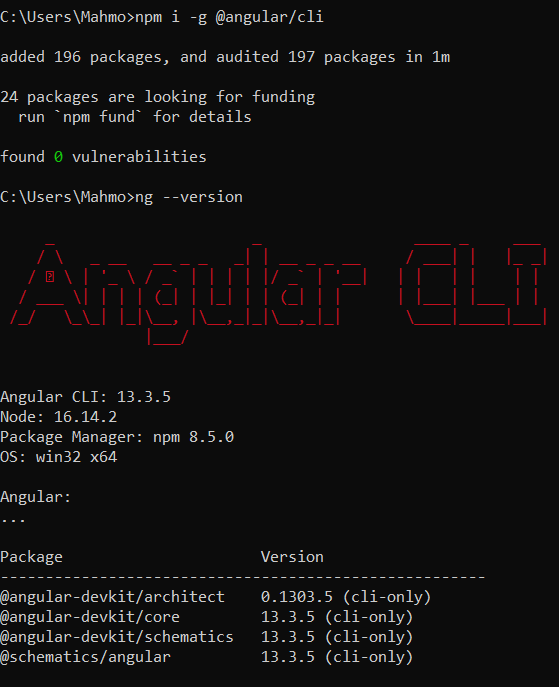
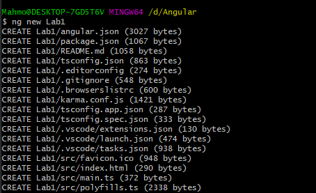
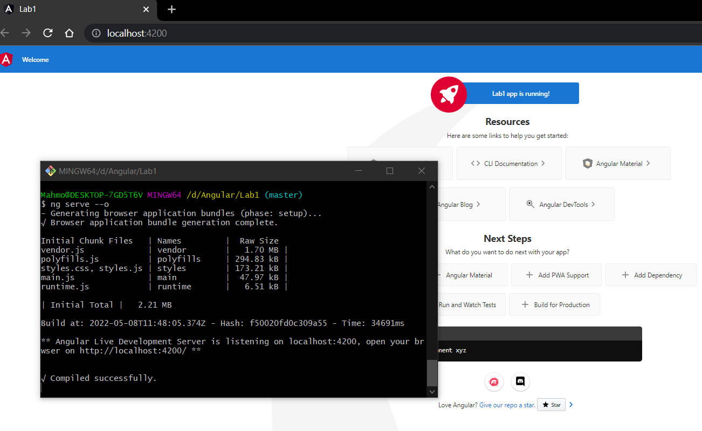
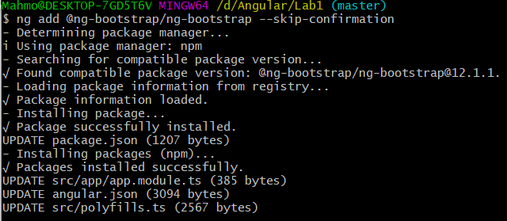
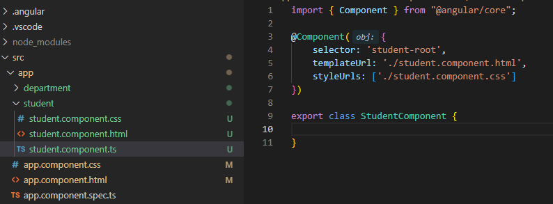
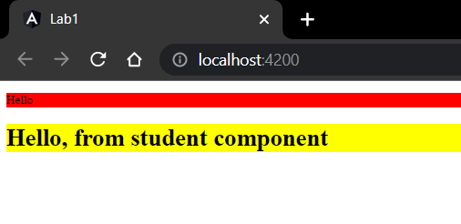
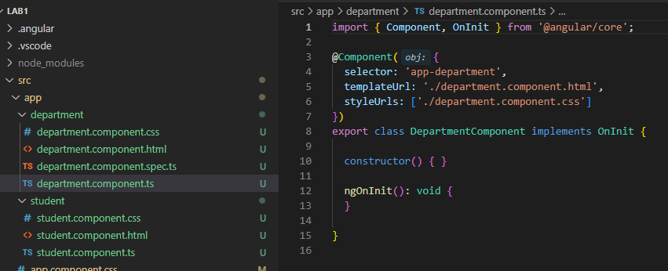
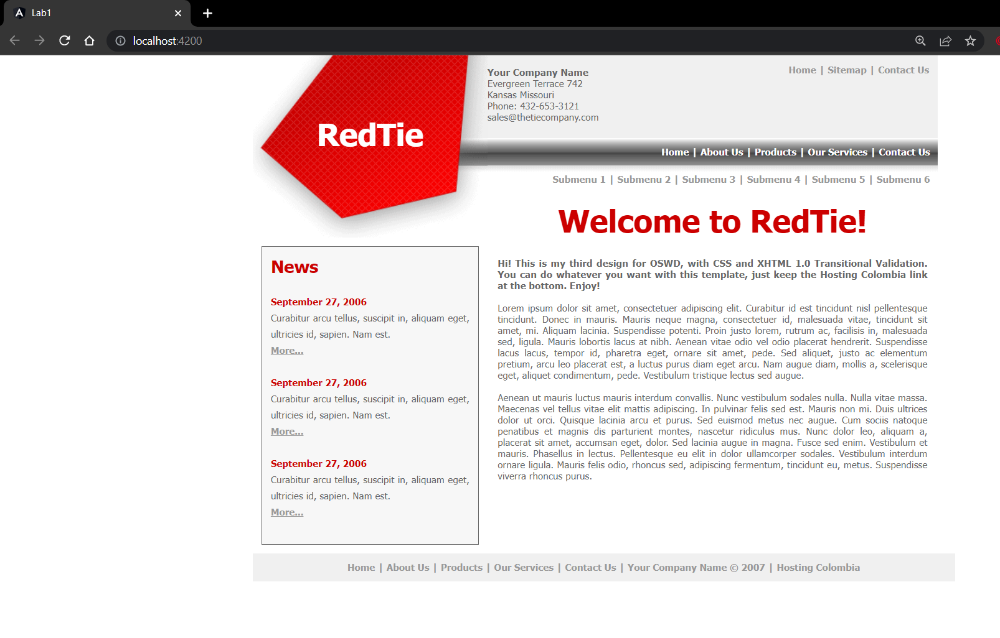

# Angular - Lab 1
[iti-Angular-labs/Lab1](https://github.com/MahmoudFierro98/iti-Angular-labs/tree/main/Lab1)

## 1- Install latest version Node , Then use npm to install angular cli globally.
1- Install node.js last version https://nodejs.org/en/download/ \
2- Open node.js command prompt
```
> npm i -g @angular/cli
```
```
> ng –version
```


## 2- Create new angular application.
```
$ ng new Lab1
```
```
$ cd Lab1
```


## 3- Serve the application.
```
$ ng serve --o
```


## 4- Install bootstrap.
```
$ ng add @ng-bootstrap/ng-bootstrap --skip-confirmation 
```
Install jQuery.
```
$ npm install jquery --
```


## 5- Create student component manually.



## 6- Create department component using angular cli.
```
$ ng g c department
```


## 7- Use redtie html to create components ( Header , Footer , Sidebar )
```
$ ng g c header
```
```
$ ng g c footer
```
```
$ ng g c sidebar
```


## Authors
* LinkedIn - [Mahmoud Mohamed Kamal](https://www.linkedin.com/in/mahmoudfierro98)

<p align="right">(<a href="#top">Top</a>)</p>
