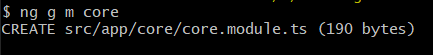
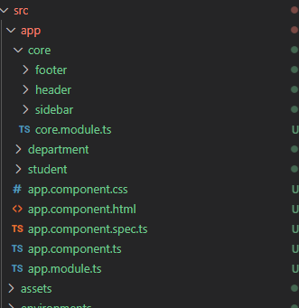
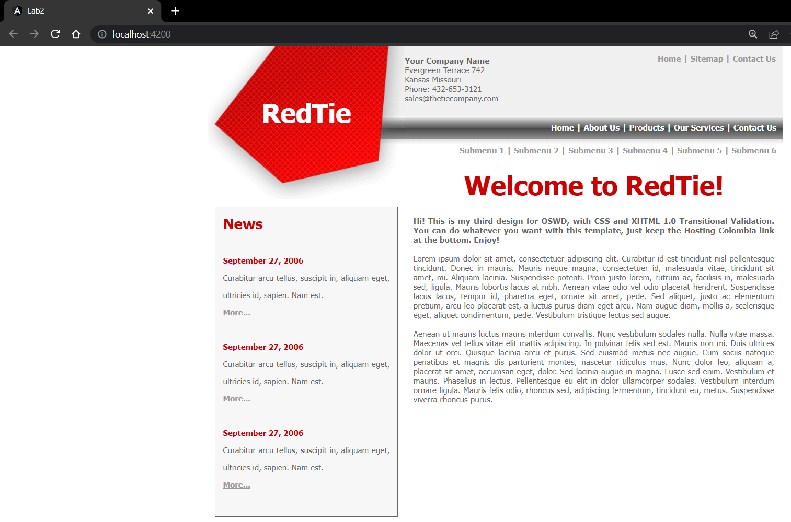
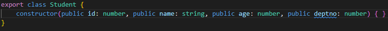
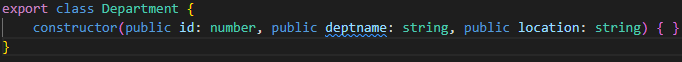
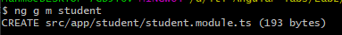
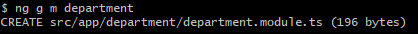

# Angular - Lab 2
[iti-Angular-labs/Lab2](https://github.com/MahmoudFierro98/iti-Angular-labs/tree/main/Lab2)

## 1- Create core module.
```
$ ng g m core
```


## 2- Add header, footer and sidebar to the core module.
```
$ ng g c core/header
```
```
$ ng g c core/footer
```
```
$ ng g c core/sidebar
```



## 3- Create student model (id, name, age, deptno).
```
$ ng g class _models/student --skip-tests
```


## 4- Create department model (id, deptname, location).
```
$ ng g class _models/department --skip-tests
```


## 5- Create student module.
```
$ ng g m student
```


## 6- Create student component belongs to student module.
```
$ ng g c student/student
```


## 7- Create department module.
```
$ ng g m department
```


## 8- Create department component belongs to department module.
```
$ ng g c department/department
```


## Authors
* LinkedIn - [Mahmoud Mohamed Kamal](https://www.linkedin.com/in/mahmoudfierro98)

<p align="right">(<a href="#top">Top</a>)</p>
