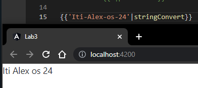

# Angular - Lab 3
[iti-Angular-labs/Lab3](https://github.com/MahmoudFierro98/iti-Angular-labs/tree/main/Lab3)

## 1- Create a powerTox custom pipe. Takes two numbers x,y and returns value of x^y.
```
$ ng g p powerTox --skip-tests
```
```
import { Pipe, PipeTransform } from '@angular/core';

@Pipe({
  name: 'powerTox',
  pure: false
})
export class PowerToxPipe implements PipeTransform {

  transform(value: number, exponent: number): number {
    return Math.pow(value, exponent);
  }

}
```


## 2- Create a stringConvert Custom pipe. (takes a string and replace each - in the string with space).
```
$ ng g p stringConvert --skip-tests
```
```
import { Pipe, PipeTransform } from '@angular/core';

@Pipe({
  name: 'stringConvert',
  pure: false
})
export class StringConvertPipe implements PipeTransform {

  transform(value: string): string {
    return value.split('-').join(' ');;
  }

}
```


## 3- Create a array-splice pipe. (takes array and a filter string and returns array that each element in it contains the specified filter string).
```
$ ng g p arraySplice --skip-tests
```
```
import { Pipe, PipeTransform } from '@angular/core';

@Pipe({
  name: 'arraySplice',
  pure: false
})
export class ArraySplicePipe implements PipeTransform {

  transform(value: unknown[], filter: string): unknown {
    let result = value.filter(element => element === filter);
    console.log(result);
    if (!result.length) {
      return "Not Found";
    }
    return result;
  }

}
```


## 4- PrimeNG
(PrimeNG)[https://www.primefaces.org/primeng/setup].
```
$ npm install primeng --save
```
```
$ npm install primeicons --save
```


## 5- Angular Material
(Angular Material)[https://material.angular.io/guide/getting-started].
```
$ ng add @angular/material --skip-confirmation
```


## 6- Install bootstrap & fron-awesome libraries.
```
$ npm i bootstrap font-awesome
```


## 7- Create star component in shared module.
```
$ ng g m shared
```
```
$ ng g c shared/star --skip-tests
```


## 8- Apply CRUD operation for product.
```
$ ng g class _models/product --skip-tests
```
```
$ ng g m product
```
```
$ ng g c product/product --skip-tests
``` 


## Authors
* LinkedIn - [Mahmoud Mohamed Kamal](https://www.linkedin.com/in/mahmoudfierro98)

<p align="right">(<a href="#top">Top</a>)</p>
