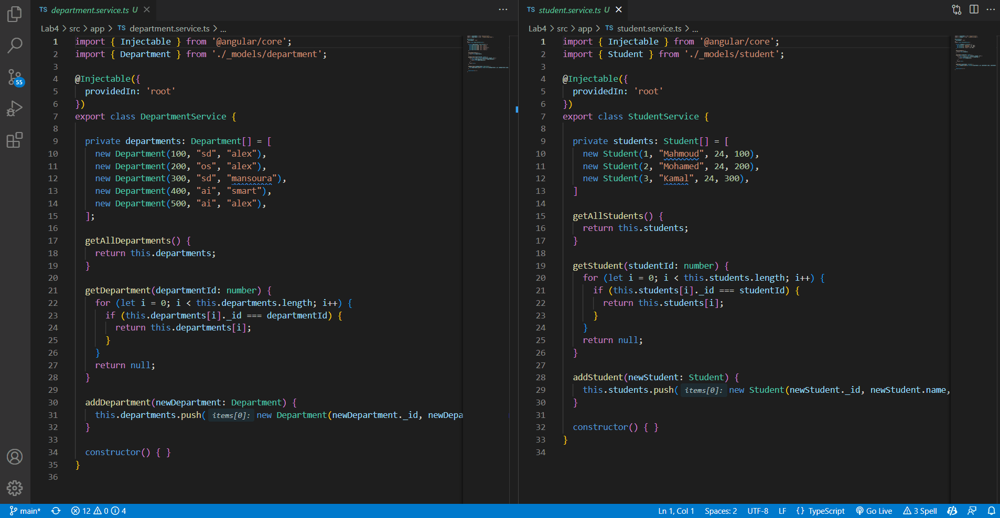
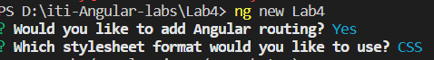
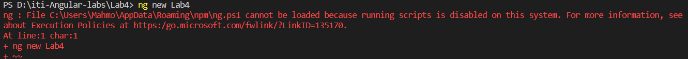

# Angular - Lab 4
[iti-Angular-labs/Lab4](https://github.com/MahmoudFierro98/iti-Angular-labs/tree/main/Lab4)



## Create new project "Lab4"
```
$ ng new Lab4
```


## Add bootstrap
```
$ npm i bootstrap
```

## Create Department and Student Models
```
$ ng g class _models/department --skip-tests
```
```
$ ng g class _models/student --skip-tests
```

## Create Department and Student Modules
```
$ ng g m department 
```
```
$ ng g m student 
```

## Create Department Components
```
$ ng g c department/departmentAdd --skip-tests
```
```
$ ng g c department/departmentList --skip-tests
```
```
$ ng g c department/departmentDetails --skip-tests
```

## Create Student Components
```
$ ng g c student/studentAdd --skip-tests
```
```
$ ng g c student/studentList --skip-tests
```
```
$ ng g c student/studentDetails --skip-tests
```

## Create Department and Student Services
```
$ ng g s department --skip-tests 
```
```
$ ng g s student --skip-tests
```

## To fix this error in VSC terminal

[Stack Overflow](https://stackoverflow.com/questions/54776324/powershell-bug-execution-of-scripts-is-disabled-on-this-system)
```
$ Set-ExecutionPolicy -ExecutionPolicy RemoteSigned -Scope LocalMachine
```
```
$ Set-ExecutionPolicy RemoteSigned -Scope CurrentUser
```
```
$ Get-ExecutionPolicy -List
```

## Authors
* LinkedIn - [Mahmoud Mohamed Kamal](https://www.linkedin.com/in/mahmoudfierro98)

<p align="right">(<a href="#top">Top</a>)</p>
