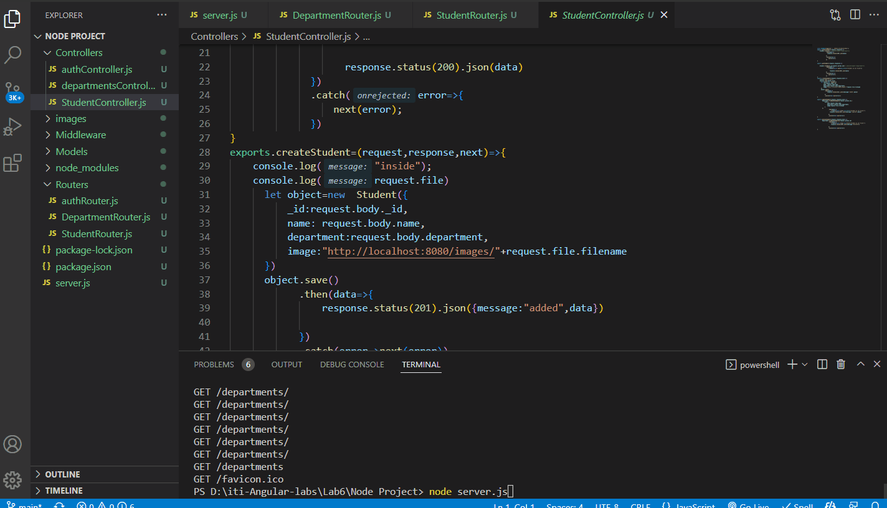
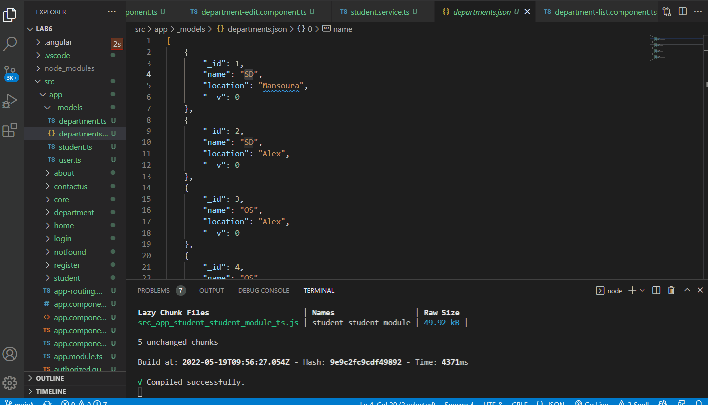

# Angular - Lab 6
[iti-Angular-labs/Lab6](https://github.com/MahmoudFierro98/iti-Angular-labs/tree/main/Lab6)



## Import data to Database


## Angular
```
$ npm install
```
```
$ ng serve --o
```

## node server
```
$ npm install
```
```
$ node server.js
```

# Author
* LinkedIn - [Mahmoud Mohamed Kamal](https://www.linkedin.com/in/mahmoudfierro98)

<p align="right">(<a href="#top">Top</a>)</p>
