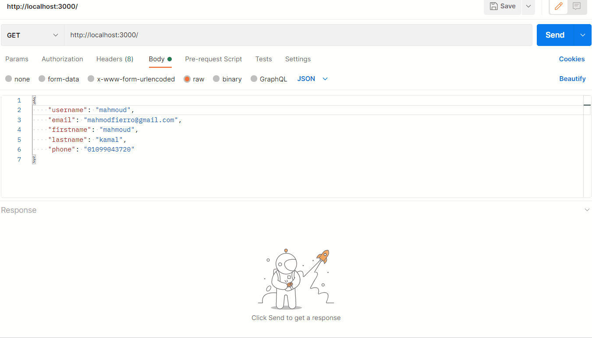

# Node.js Lab 5 - Task 1 CRUD

## GIF



## Process:
 ```
   npm install
 ```
 ```
   npm start
 ```

## Built with

* [Node JS](https://nodejs.org/en/download/)
* [JS](https://www.javascript.com/)
* [express.js](https://expressjs.com/)
* [nodemon](https://www.npmjs.com/package/nodemon)

## Author

* LinkedIn - [Mahmoud Mohamed Kamal](https://www.linkedin.com/in/mahmoudfierro98)

<p align="right">(<a href="#top">Top</a>)</p>
