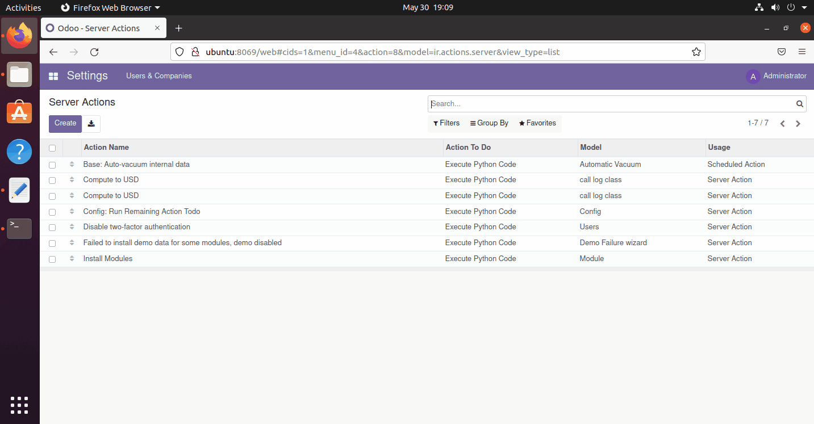

# odoo - Lab 3


## Commands
```
$ cd odoo-15.0.post20220525/
```
```
$ sudo apt install wkhtmltopdf
```
```
sudo systemctl stop postgresql
```
```
$ sudo docker start itios
```
```
$ ./odoo-bin --db_host=localhost --db_user=odoo --db_password=odoo --db_port=5432 --addons-path=/home/odoo-addons/
```

## Author
* LinkedIn - [Mahmoud Mohamed Kamal](https://www.linkedin.com/in/mahmoudfierro98)

<p align="right">(<a href="#top">Top</a>)</p>