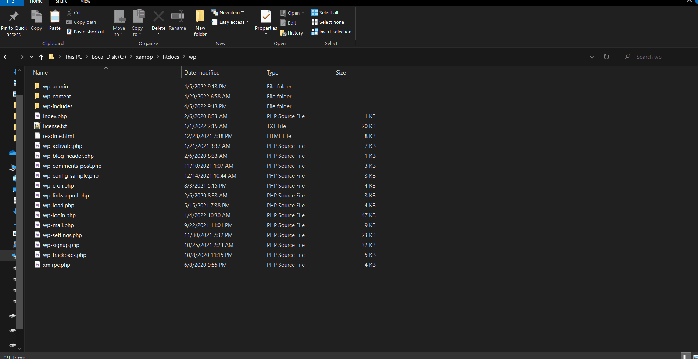
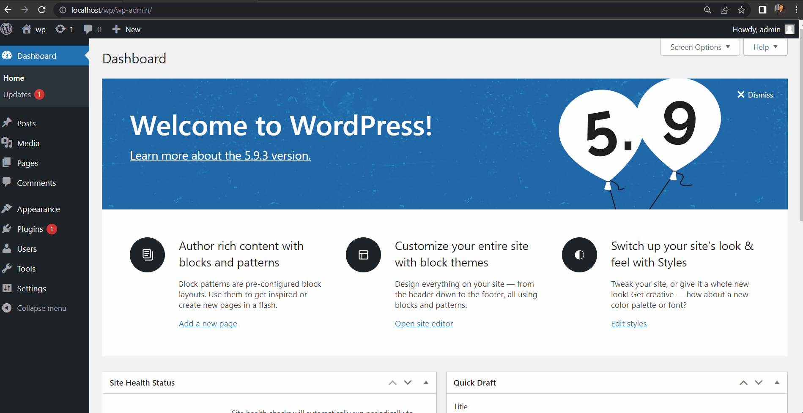
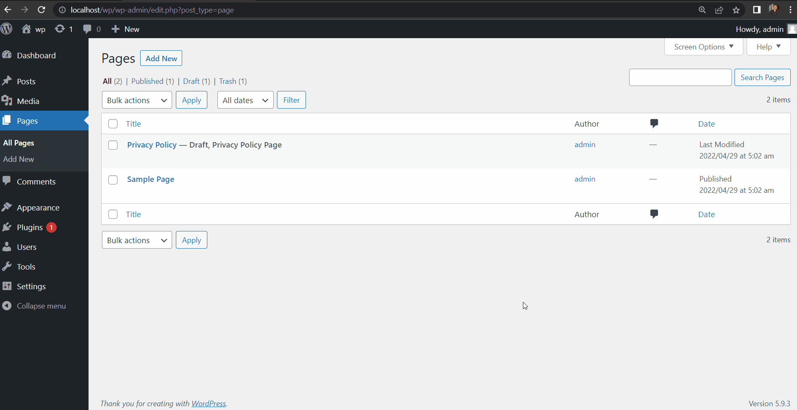

# PHP CMSs (WordPress) - Lab 1

## Table of contents
- [1- install WordPress](#1--install-WordPress)
- [2- install theme](#2--install-theme)
- [3- create homepage](#3--create-homepage)
- [4- create post category & 5- create post](#4--create-post-category--5--create-post)
- [6- create contact page with contact form](#6--create-contact-page-with-contact-form)
- [Author](#authors)

## 1- install WordPress

## 2- install theme

- [How to enable GD Library with XAMPP](https://write.corbpie.com/how-to-enable-gd-library-with-xampp-php-8-on-windows/) 
- Customize the theme: 

## 3- create homepage

## 4- create post category & 5- create post

## 6- create contact page with contact form

## Authors

* LinkedIn - [Mahmoud Mohamed Kamal](https://www.linkedin.com/in/mahmoudfierro98)

(<a href="#top">Top</a>)

