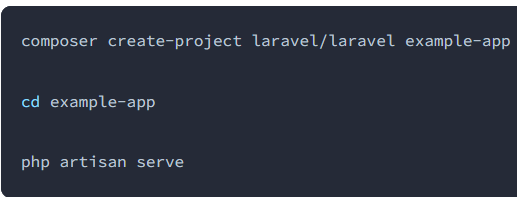
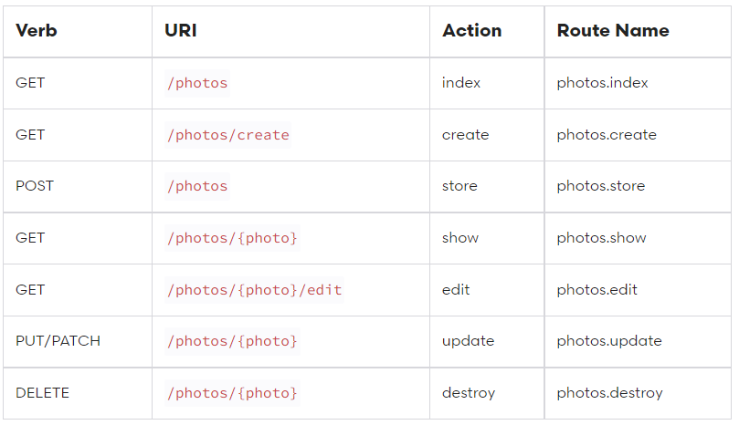
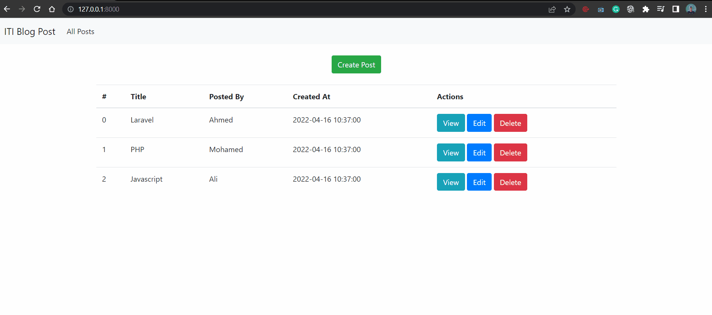

# PHP Web Frameworks (Laravel) Labs

[Labs in my main iti repository](https://github.com/MahmoudFierro98/ITI_OpenSourceApplicationDevelopment/tree/main/PHP_Web_Frameworks/Labs)  
[Labs in Laravel repository](https://github.com/MahmoudFierro98/iti-laravel-labs)  

## Table of contents

- [Overview](#overview)
    - [Introduction](#introduction)
    - [GIF Day 1](#gif-day-1)
    - [Process](#process)
    - [Built with](#built-with)
- [Author](#authors)

## Overview

### Introduction

- Installation Via Composer /

- Actions Handled By Resource Controller


### GIF Day 1



### Process

 ```
   php artisan serve
 ```

### Built with

* [PHP](https://www.php.net/)
* [Laravel](https://laravel.com/)


## Authors

* LinkedIn - [Mahmoud Mohamed Kamal](https://www.linkedin.com/in/mahmoudfierro98)

<p align="right">(<a href="#top">Top</a>)</p>
