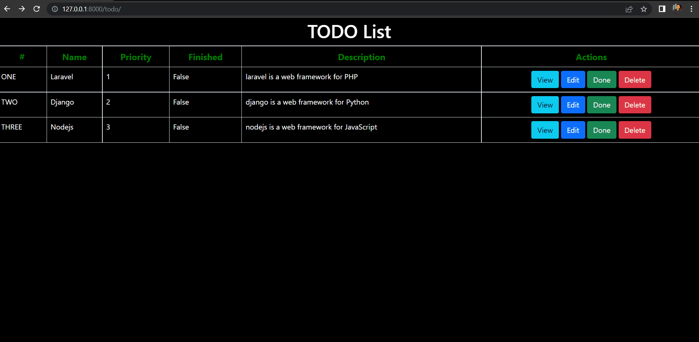

# Django - Lab 1
[iti-Django-labs/Lab1](https://github.com/MahmoudFierro98/iti-Django-labs/tree/main/Lab1)



## Commands
```
py -m venv iti-env
```
```
iti-env\Scripts\activate.bat
```
```
py -m pip install Django
```
```
django-admin startapp lab1
```
```
django-admin startproject first_app
```
```
python first_app/manage.py runserver
```
```
cd first_app
```
```
django-admin startapp todom i bootstrap
```

# Author
* LinkedIn - [Mahmoud Mohamed Kamal](https://www.linkedin.com/in/mahmoudfierro98)

<p align="right">(<a href="#top">Top</a>)</p>
