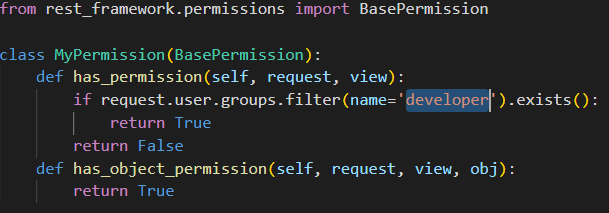

# Django - Lab 4
[iti-Django-labs/Lab4](https://github.com/MahmoudFierro98/iti-Django-labs/tree/main/Lab4)




## Commands
```
py -m venv env
```
```
env\Scripts\activate.bat
```
```
py -m pip install Django
```
```
pip install mysqlclient
```
- [django-crispy-forms](https://simpleisbetterthancomplex.com/tutorial/2018/08/13/how-to-use-bootstrap-4-forms-with-django.html)
```
pip install django-crispy-forms
```
```
python -m pip install Pillow
```
```
python pip install django-extensions
```
```
python pip install djangorestframework
```
```
django-admin startproject lab4
```
```
python lab4/manage.py runserver
```
```
cd lab4
```
```
py .\manage.py collectstatic
```
```
py .\manage.py reset_db
```
```
py .\manage.py makemigrations
```
```
py .\manage.py migrate
```
```
py .\manage.py createsuperuser
```

# Author
* LinkedIn - [Mahmoud Mohamed Kamal](https://www.linkedin.com/in/mahmoudfierro98)

<p align="right">(<a href="#top">Top</a>)</p>
