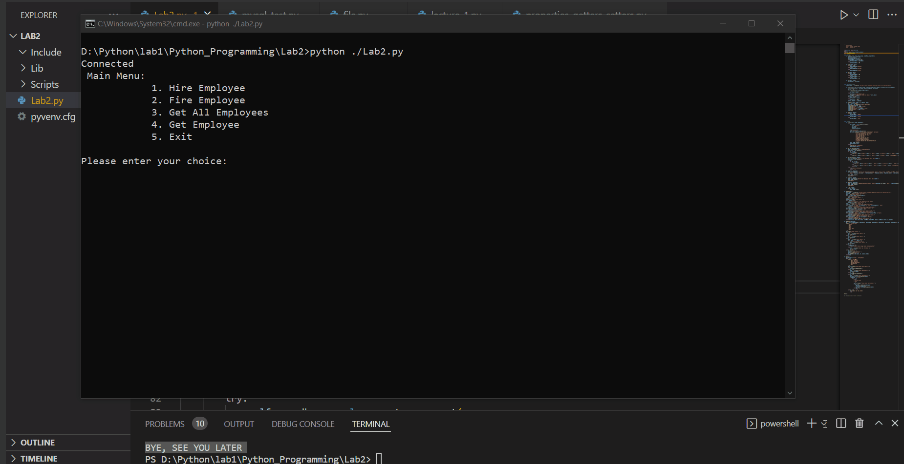

# Python Programming - Lab 2



## [Decorators in Python](https://www.geeksforgeeks.org/decorators-in-python/)
Decorators are a very powerful and useful tool in Python since it allows programmers to modify the behaviour of function or class. Decorators allow us to wrap another function in order to extend the behaviour of the wrapped function, without permanently modifying it. But before diving deep into decorators let us understand some concepts that will come in handy in learning the decorators. \
Example:
```
def decor1(func):
    def inner():
        x = func()
        return x * x
    return inner
 
def decor(func):
    def inner():
        x = func()
        return 2 * x
    return inner
 
@decor1
@decor
def num():
    return 10
 
print(num())
```
Output:
```
400
```

## [What is the difference between sort() and sorted()?](https://discuss.codecademy.com/t/what-is-the-difference-between-sort-and-sorted/349679)
The primary difference between the list sort() function and the sorted() function is that the sort() function will modify the list it is called on. The sorted() function will create a new list containing a sorted version of the list it is given. The sorted() function will not modify the list passed as a parameter. \
Example:
```
vegetables = ['squash', 'pea', 'carrot', 'potato']

new_list = sorted(vegetables)

# new_list = ['carrot', 'pea', 'potato', 'squash']
print(new_list)

# vegetables = ['squash', 'pea', 'carrot', 'potato']
print(vegetables)

vegetables.sort()

# vegetables = ['carrot', 'pea', 'potato', 'squash']
print(vegetables)
```

## [Lambda expression (Anonymous function)](https://www.programiz.com/python-programming/anonymous-function#:~:text=What%20are%20lambda%20functions%20in,are%20also%20called%20lambda%20functions.)
In Python, an anonymous function is a function that is defined without a name. While normal functions are defined using the def keyword in Python, anonymous functions are defined using the lambda keyword. Hence, anonymous functions are also called lambda functions. \
Syntax of Lambda Function in python:
```
lambda arguments: expression
```
Example:
```
double = lambda x: x * 2
print(double(5))
```
Output:
```
10
```

## [Python iter()](https://www.programiz.com/python-programming/methods/built-in/iter)
The Python iter() function returns an iterator for the given object, The iter() function creates an object which can be iterated one element at a time, These objects are useful when coupled with loops like for loop, while loop. \
The syntax of the iter() function is:
```
iter(object, sentinel)
```
Example:
```
# list of vowels
vowels = ['a', 'e', 'i', 'o', 'u']
vowels_iter = iter(vowels)

print(next(vowels_iter))    # 'a'
print(next(vowels_iter))    # 'e'
print(next(vowels_iter))    # 'i'
print(next(vowels_iter))    # 'o'
print(next(vowels_iter))    # 'u'
```
Output:
```
a
e
i
o
u
```

## [Copy in Python (Deep Copy and Shallow Copy)](https://www.geeksforgeeks.org/copy-python-deep-copy-shallow-copy/)
A copy is sometimes needed so one can change one copy without changing the other. In Python, there are two ways to create copies: 
- Deep copy
- Shallow copy
Example (deepcopy):
```
# importing "copy" for copy operations
import copy
  
# initializing list 1
li1 = [1, 2, [3,5], 4]
  
# using deepcopy to deep copy 
li2 = copy.deepcopy(li1)
  
# original elements of list
print ("The original elements before deep copying")
for i in range(0,len(li1)):
    print (li1[i],end=" ")
  
print("\r")
  
# adding and element to new list
li2[2][0] = 7
  
# Change is reflected in l2 
print ("The new list of elements after deep copying ")
for i in range(0,len( li1)):
    print (li2[i],end=" ")
  
print("\r")
  
# Change is NOT reflected in original list
# as it is a deep copy
print ("The original elements after deep copying")
for i in range(0,len( li1)):
    print (li1[i],end=" ")
```
Output:
```
The original elements before deep copying
1 2 [3, 5] 4 
The new list of elements after deep copying 
1 2 [7, 5] 4 
The original elements after deep copying
1 2 [3, 5] 4
```
Example (copy):
```
# importing "copy" for copy operations
import copy

# initializing list 1
li1 = [1, 2, [3,5], 4]

# using copy to shallow copy
li2 = copy.copy(li1)

# original elements of list
print ("The original elements before shallow copying")
for i in range(0,len(li1)):
	print (li1[i])

print("\r")

# adding and element to new list
li2[2][0] = 7

# checking if change is reflected
print ("The original elements after shallow copying")
for i in range(0,len( li1)):
	print (li1[i])
```
Output:
```
The original elements before shallow copying
1 2 [3, 5] 4 
The original elements after shallow copying
1 2 [7, 5] 4 
```

## [Python function enumerate()](https://www.guru99.com/python-enumerate-function.html#:~:text=Python%20Enumerate()%20is%20a,object%20as%20an%20output%20string.)
Python Enumerate() is a built-in function available with the Python library. It takes the given input as a collection or tuples and returns it as an enumerate object. The Python Enumerate() command adds a counter to each item of the iterable object and returns an enumerate object as an output string. \
Syntax of Python enumerate():
```
enumerate(iterable, startIndex)
```
Example:
```
mylist = ['A', 'B' ,'C', 'D']
e_list = enumerate(mylist)
print(list(e_list))
```
Output:
```
[(0, 'A'), (1, 'B'), (2, 'C'), (3, 'D')]
```

## [3- Import operator module](https://www.javatpoint.com/operator-module-in-python)

# Author
* LinkedIn - [Mahmoud Mohamed Kamal](https://www.linkedin.com/in/mahmoudfierro98)

<p align="right">(<a href="#top">Top</a>)</p>
