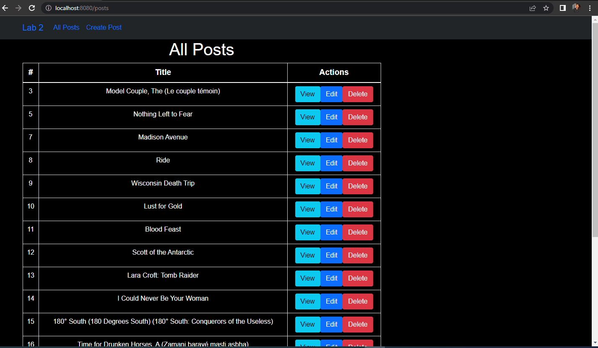

# VueJS - Lab 2
[iti-VueJS-labs/Lab2](https://github.com/MahmoudFierro98/iti-VueJS-labs/tree/main/Lab2)



## Commands
- Install VueJS
```
npm i -g @vue/cli
```

- Create new project "lab1"
```
vue create lab1
```

- Run 
```
cd lab1
```
```
npm run serve
``` 

- Install Packages 
```
npm i
```
```
npm i bootstrap jquery popper
```
```
npm i axios
```
```
npm i vue-router@4
```

# Author
* LinkedIn - [Mahmoud Mohamed Kamal](https://www.linkedin.com/in/mahmoudfierro98)

<p align="right">(<a href="#top">Top</a>)</p>
