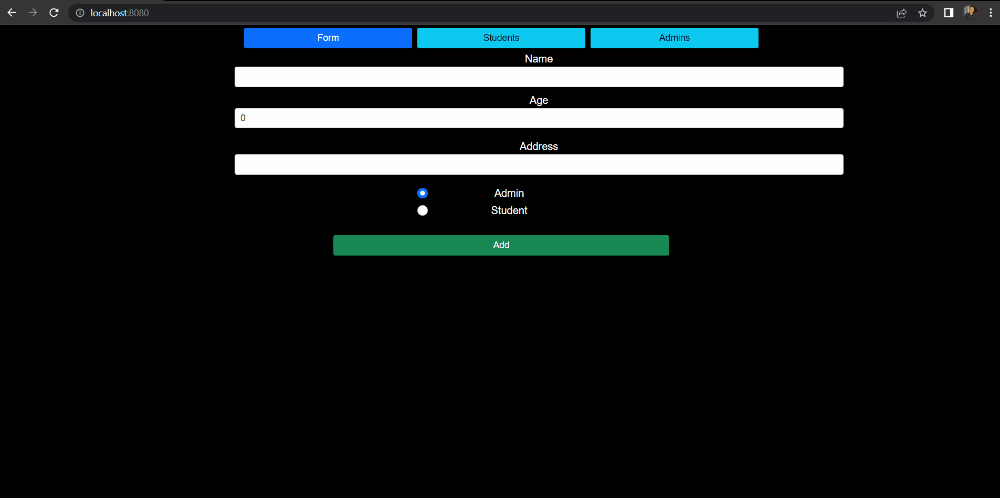

# VueJS - Lab 3
[iti-VueJS-labs/Lab3](https://github.com/MahmoudFierro98/iti-VueJS-labs/tree/main/Lab3)



## Commands
- Install VueJS
```
$ npm i -g @vue/cli
```

- Create new project "lab3"
```
$ vue create lab3
```

- Install Packages 
```
$ npm i 
```

- Run 
```
$ cd lab3
```
```
$ npm run serve
``` 

# Author
* LinkedIn - [Mahmoud Mohamed Kamal](https://www.linkedin.com/in/mahmoudfierro98)

<p align="right">(<a href="#top">Top</a>)</p>
